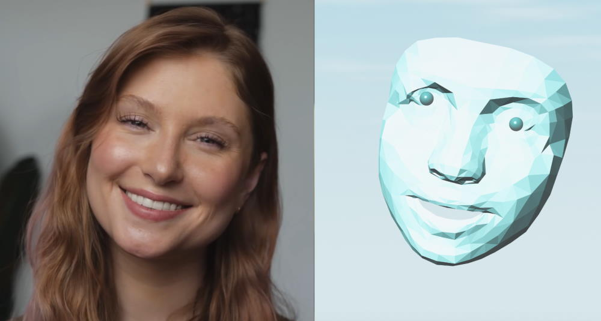
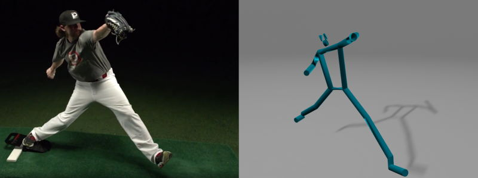
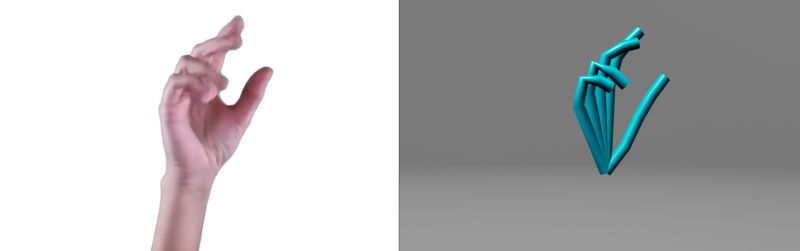

# Human: 3D Motion Visualization

- Input  
  **Video file**  
  **Live webcam**  
- Analyze and track all keypoints in a *web worker* thread  
  Using [**Human**](https://github.com/vladmandic/human) library  
  **Face**, **Body**, **Hands**
- Display  
  **Video Overlay** with keypoints  
  **3D Mesh** with *pan/zoom/rotate* functionality

 

 

## Run

 

### Online

> [**Live Demo**](https://vladmandic.github.io/human-motion/src/index.html)

### Offline

- Clone or fork the repository
- Install dependencies: `npm install`
- Start HTTPS server using precompiled code: `npm start`
- Navigate to <https://localhost:8001>

### Development Mode

- Clone or fork the repository
- Compile code on-demand & start HTTPS server: `npm run dev`
- Navigate to <https://localhost:8001>

## Notes

- All heavy-lifting (machine learning processing) is performed using [**Human**](https://github.com/vladmandic/human) library  
- Enabled models are: **BlazeFace-Back, FaceMesh-with-Attention, BlazePose-Heavy, HandTrack, HandDetect**  
- **2D** visualization is performed using built-in draw methods in `Human` library  
- **3D** visualization is performed using [BabylonJS](https://www.babylonjs.com/)  

## Processing

Process flow is separated into two loops:
- **Process loop**  
  Runs in web-worker so its not blocking the main thread  
  Supports `WASM`, `WebGL` and `WebGPU` backends  
  Runs as fast as possible: frame is submited to worker and as soon as results are available a new frame is submitted  
- **Render loop**  
  Runs at fixed 60 FPS  
  Draws both **2D** canvas overlay and **3D** GL mesh  
  Uses intepolated (for smoother output) results based on last known processed results from process loop  
